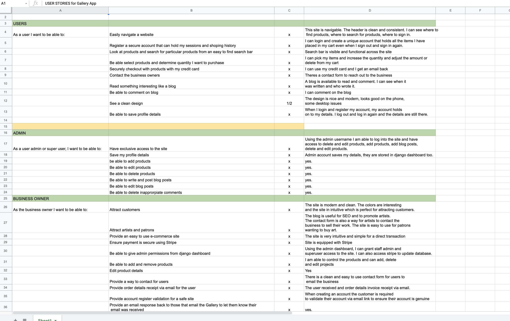
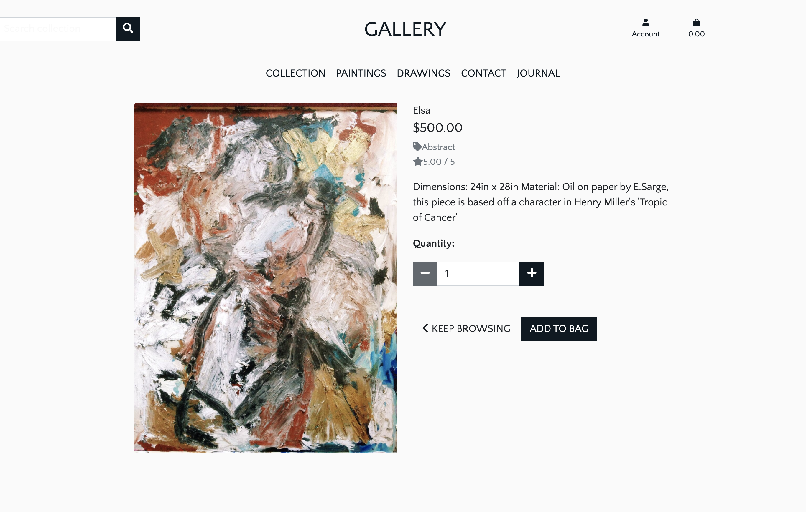
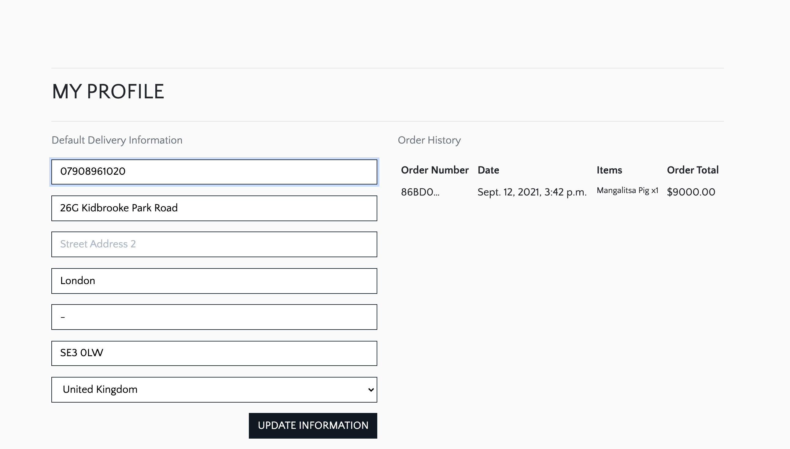
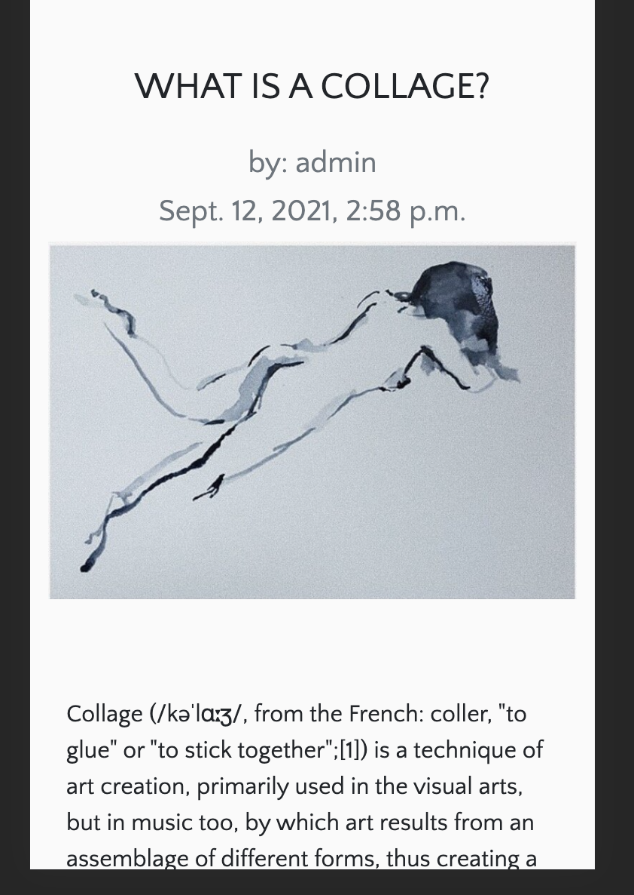

# Gallery Project #
---
[**View the full project here**](https://the-gallery-project.herokuapp.com/)


## Contents ##
---

* Research
* UX
    * [User Stories](#user-stories)
    * [Strategy Goals](#strategy)
    * [Scope](#scope)
    * [Structure](#structure)
    * [Wireframes](#wireframes)
    * [DataBase Schema](#schema)
    * [Design](#design)
        * [Colors](#colors)
        * [Fonts](#fonts)
        * [Icons](#icons)
    * [Defensive Design](#defensivedesign)
* [Technologies](#technologies)
    * [Languages and Frameworks](#landf)
    * [Tools](#tools)
* [Features](#features)
    * [Existing Features](#existing)
    * [Future Features](#future)
* [Testing](#testing)
* [Issues](#issues)
* [Deployment](#deployment)
    * [Requirements](#required)
    * [Local deployment](#locald)
    * [Deployment to Heroku](#dheroku) 
* [Credits and References](#credits)

## Research ##
---

For Gallery, I wanted to attempt a revisable online community gallery as many artists find it difficult to make their own websites to show their own work. This site offers an opportunity for exposure, selling their pieces and prints. 

I looked at a number of portfolio and gallery sites, including the one I made with SquareSpace to make an e-commerce version that is more intuitive than many sites available. 

If you would like to use the admin account to test admin settings, please email me at emmasargeant206@gmail.com.

## UX (User Experience) ##
---
<a name="user-stories"></a>
### User Stories ###

I used the Boutique Ado as a reference, I followed the user stories shared and created one in a Google Docs spreadsheet.
* [Click here to view](https://docs.google.com/spreadsheets/d/1_1PLjGptzSAbOWP1vXC1fD3hp-4bqpj3bSi4dvUwiF0/edit#gid=0)

* 

<a name="strategy"></a>
### Strategy Goals ###

#### Business Goals ####
* To exhibit a collection of paintings and drawings.
* To create a gallery feel with CSS
* To sell paintings and prints
* To offer blogs to admin artisits
* To allow users to leave reviews on products to control product quality and popularity.
* To build a collection of products to sell online and manage the sales as admin.
* To be able to create/update/delete products and their details as admin
* To enable users to create an account for purchases.

#### User Goals ####

* To navigate the website easily and understand its purpose.
* To easily find products with the search bar.
* To be able to buy pieces of art online as a guest or with an account.
* To receive a confirmation email with order information after purchase.
* To be able to manage my account details.

<a name="Scope"></a>

### Scope ### 

The users should expect the following:

* Navigation bar works on all devices and platforms.
* Working product search by category, text and price in the search bar to provide appropriate results.
* Check product information when clicked.
* Add/remove items from the cart.
* Add multiple items to the cart.
* Cart total is updated everytime product is added
* Purchase products securely with Stripe.
* Create/Update/Save/Delete profile account details.

As an Admin:
* Add, edit, delete a product and details
* Create/Update products.


<a name="wireframes"></a>

### Wireframes ###

Wireframe were created with [**Balsamiq**](https://balsamiq.com/).

* [Gallery Forms Wireframes](readme/forms.png)
* [Gallery Homepage Wireframes](readme/homepage.png)
* [Gallery Product Details Wireframes](readme/product-details.png)
* [Gallery Product and Blog Page Wireframes](readme/product-blog-page.png)

* The wireframe are brief stuctures of the site in initial steps of development.


<a name="schema"></a>

### Schema ###

* Using my python models, I put together a schema, an outline of the database and how it engages with each app to run the program from the backend. You will see how a user will log in and their journey to check out, read and comment on a block and more. 


<a name="design"></a>

### Design ###

The intent was to create contemporary and simply e-commerce site that looks like a modern gallery. I used off white colors and greys to resemble galleries in major cities and to provide more focus on the art. 

<a name="colors"></a>

##### Colors ####

* I used a very muted it palette to reflect on the serenity of a gallery space with soft white walls, very minimalistic. This also helps to draw attention to the products, the paintings and drawings

The colors I used were :
* #fafafa for an off white, 
* #212529 a soft gray 
* #f2ba21 for a warm mustard color like sunlight.

<a name="fonts"></a>

### Fonts ###

* I wanted to a clean and classic look to the site and I used Georgia Sans which is used by Vogue and 'Quattrocento Sans', sans-serif for a clean and minimalistic font that was a little more modern.

<a name="icons"></a>

### Icons ###

* All icons I used are from the library  [**FontAwesome**](https://fontawesome.com/)


<a name="defensivedesign"></a>

### Defensive Design ###

1. Users register their own profile with password.
2. All required form inputs display a warning message as a tooltip if the field is filled incorrectly.
3. If a non-registered user tries to leave a comment or a review, they will be automatically redirected to the sign-in page.
4. Integration of webhooks from Stripe create order status in the database and avoid any misstep from the user during checkout.
5. When forms are submitted (search, product, purchase, the user is notified success/failure with a toast message.


<a name="technologies"></a>

## Technologies ##
---

### Languages and Frameworks ###
* [HTML](https://developer.mozilla.org/en-US/docs/Web/HTML)
* [CSS](https://developer.mozilla.org/en-US/docs/Web/CSS)
* [Javascript](https://www.javascript.com/)
* [JQuery](https://jquery.com/)
* [Bootstrap](https://getbootstrap.com/)
* [Font-Awesome](https://fontawesome.com/icons?d=gallery)
* [Django](https://github.com/django/django)
* [Python](https://www.python.org/)
* [SQLite](https://www.sqlite.org/index.html)


### Tools  ###

* [Google fonts](https://fonts.google.com/)
* [Git](https://git-scm.com/)
* [Gitpod](https://gitpod.io/)
* [Heroku](https://heroku.com/)
* [AWS](https://aws.amazon.com/)
* [Balsamiq](https://balsamiq.com/)
* [Favicon.io](https://favicon.io/)
* [W3C HTML Validator](https://validator.w3.org/)
* [W3C CSS Validator](https://jigsaw.w3.org/css-validator/)
* [JSHINT](https://jshint.com/)
* [PEP8](http://pep8online.com/)


<a name="Features"></a>

## Features ##
---

<a name="existing"></a>

### Existiting Features per Apps ###

**Responsive Design**

* The responsive design allows users to use their phone, laptop, desktop or tablet to use the site.

* Using Bootstrap and media queries, I was able to apply dynamic design.

**Navigation**

* Gallery's sight offers a custom desktop and mobile nav bar
* Navbar offers search capabilities
* Access to profile, cart and products
* Product tabs filter product type

**Home App**
[see here](readme/homepage.png)

* This page is a simply welcome page with a hero immage
* There is also a CTA to go to the collection of products

**Cart App**

* This app allows users to add/adjust/delete products to their cart and view the total price and product details
* When a product is added, a preview of the shopping bag is displayed in a toast and the total price/shipping price is updated.

**Checkout App**

* Using **Stripe**, the user can securely make a payment for their cart.
* The user can be a guest without a profile and still able to buy the product.
* Input forms strictly require all necessary information for payment security.
* The credit card details section is linked to the payment platform **Stripe** for secure payment. 
* If payment fails, user is notified.
* Successful payments receive an email notification with their order details.


**Product App** 



* This app displays all products and separate product details as well as Add/Edit/Delete when they are logged in. It also allows the admin to Add/Edit/Delete products in the database.

1. Products page:
* Products are displayed.
* Products can be filtered by category, price, rating etc

2. Product detail page:
* Displays individual product and add to cart functions.

3. Product management:
* Admins can access DB to manage products, delete, and changer their details.


**Profile App**




* This app collects user data to create a unique profile on the website and provide registered user access. 
1. Registration
* User can register as a new user
* The email and password need to be confirmed twice.
* A verification email is sent to new user's email. The email contains a security link to confirm the user account.

2. Signing in.
* Registered users can sign into their account and view their saved shopping list.

* Once the login form is approved, the user is redirected to their profile page containing their personal information.

3. Log out
* User can log out of their account.

4. Profile Page:
* The profile page is personal and contains:
    - Information form including the shipping details.
    - An order history with order number, date and order details. The order number links to the order confirmation page.

**Blog App**



* Blog is contributed to by admins, the blog offers an opportunity to write about showcasing artists, art techniques and shows. Also a tool to boost SEO

1. Blog page:
* Blog page displays all blog posts.

2. Blog detail page:
* Displays authors, time of submission, an image and content.

3. Comment section
* Logged in users can create comments to engage with blog
* Registered users can delete their posts.

4. Blog management:
* Only the admins can edit or delete blogs on the blog detail page. 

**Contact App**

* This app provides a point of contact for users to send emails to admins.
* Email queries are stored on database
* Visitor can be a guest or have an account to use the contact form.

All features have been tested, [please click here for Testing](TESTING.md)

<a name="future"></a>

### Future Features ###

* I would like to add a bigger art database
* Create more complex price structure to order prints of various sizes and prices.
* I would like to apply more animation.
* Provide options for made-to-order prints
* Fix some styling

## Deployment ##
---
<a name="requirements"></a>

### Requirements ###

* an IDE
* pip, for Python packages
* Python3
* Git for version control
* Stripe (account, test keys and webhooks) for payment
* AWS cloud storage for static image files
* Email account to create account

<a name="deploy"></a>

### Local Deployment ###

<a name="heroku"></a>

**1. Clone from Github**

* To this project locally on their IDE, you can clone a copy of the Github repository at https://github.com/emmasarge/gallery.git by clicking the "Download Code" button. Alternatively run command in the terminal:

$ git clone https://github.com/emmasarge/gallery.git

To remove from github to your account, use command git remote rm origin in terminal.

**2. Install Python modules**

* Run:
pip3 install -r requirements.txt

**3. Store environment variables**

* When using Gitpod, an alterantive to a .env is store environement variables to Gitpod "Settings" on dashboard and add these variables in  the "Environement Variables" section:

```
'DEVELOPMENT', 'True'
'SECRET_KEY', '<your value>'
'STRIPE_PUBLIC_KEY', '<your value>'
'STRIPE_SECRET_KEY', '<your value>'
'STRIPE_WH_SECRET', '<your value>'
```

* Otherwise create env.py file in the root directory of the project and include the following:

```
import os

os.environ["STRIPE_PUBLIC_KEY"] = "YOUR_STRIPE_PUBLIC_KEY"
os.environ["STRIPE_SECRET_KEY"] = "YOUR_STRIPE_SECRET_KEY"
os.environ["STRIPE_WH_SECRET"] = "YOUR_STRIPE_WH_SECRET"
os.environ["SECRET_KEY"] = "YOUR_SECRET_KEY_HERE"
os.environ["DEVELOPMENT"] = "True"
```

* Follow these instructions to fill in the values of each keys:
    - the SECRET_KEY : use a Django Secret Key Generator
    - the STRIPE_PUBLIC_KEY and STRIPE_SECRET_KEY found on the Stripe Developers Dashboard.
    - the STRIPE_WH_SECRET: Can be found in the Developer's API above tests.

**4. Migrate models to DB**

* Run these commands to migrate models to SQLite database:

````
python3 manage.py makemigrations
python3 manage.py migrate
````

**5. Upload data**

* Run the command in this order to upload category and product fixtures:

````
python3 manage.py loaddata categories
python3 manage.py loaddata products
````

**6. Create Superuser**

* A superUser is needed to access the admin panel in Django. Run :

````
python3 manage.py createsuperuser
````

**7. Run app**

* Enter the command below to start running the project locally on gitpod:

````
python3 manage.py runserver
````


### Heroku Deployment ###

**1. Create Heroku Account and App**

* Start by going to https://heroku.com/ and create an account or sign in your already existing account.
* Create an app with a unique name and choose local location.
* Create a postgres database

**2. Setup database**

* The DATABASE_URL variable was automatically created in the Settings // Config Vars section. Add this to your environment variables in your IDE or your env.py.

* In Heroku App, navigate to Settings and set the following variables in the Config Vars section:

`````
'AWS_ACCESS_KEY_ID', '<your value>'
'AWS_SECRET_ACCESS_KEY', '<your value>'
'DATABASE_URL', '<your value>'
'SECRET_KEY', '<your value>'
'STRIPE_PUBLIC_KEY', '<your value>'
'STRIPE_SECRET_KEY', '<your value>'
'STRIPE_WH_SECRET', '<your value>'
'USE_AWS', 'True'
`````

* Make the migrations to start using Postgres to connect to Heroku:
``````
python3 manage.py makemigrations
python3 manage.py migrate
``````
* Add category the product fixtures to connect to Heroku:
``````
python3 manage.py loaddata categories
python3 manage.py loaddata products
``````

**3. CreateSuperuser for Postgres DB**

* Run the following command to create a superuser to navigate to Django's admin panel:

``````
python3 manage.py createsuperuser
``````

**4. Create Procfile**

* Create a Procfile and add " web: python app.py "
* Push changed code to Github with these commands:
```````
git add .
git commit -m "..."
git push
```````

**5. Remove DATABASE_URL variable**

* Delete the temporary DATABASE_URL from your environement variables or env.py.

**6. Install Heroku CLI and login**

* In case your environment doesn't have it already, run this command to install the Heroku CLI in your terminal:

``````
$ heroku login
``````
* To login from the CLI run the following command in your terminal:
```````
heroku login -i
```````

**7. Settings**

*Add the hostname of your Heroku App to "ALLOWED HOSTS" in settings.py. The hostname cis in the heroku settings < App Name . 

**8. Connect repository to Heroku**

* 1. You can connect your Github repository directly in the Heroku app by selecting your repository in the Deploy tab < Deployment method. I also selected the Automatic Deployment option for convenience. Click on Deploy.

* 2. Copy the Heroku gir url in the Heroku app Setting tab and run the command below to connect your repository:

```````
$ git remote add heroku <your heroku git url>
```````

**9. Add static files to AWS S3**
* In your S3 Bucket, create folder called' media' and for all photos and media files. 
* Create a 'static' folder for Django to collect static files and upload them to S3 as soon as the app is deployed to Heroku

**10. Push to Heroku**

* Once connected to Github repository from Heroku and you have selected automatic deployment, commit and push changes and they will be applied to Heroku or in the terminal:

```````
$ git push -u heroku master
```````

The app can now be open at https://< your-app-name >.herokuapp.com/

<a name="credits"></a>

## Credits and References ##
---


**Image Credits:**

All products are my personal paintings.

**Code Tutorials Credits**

* This project was heavily referenced on the BOUTIQUE ADO project.


**Extra credits to:**

* The Slack Community and CI tutors
* HARRY DHILLON who really helped me and was so generous with his time. 

