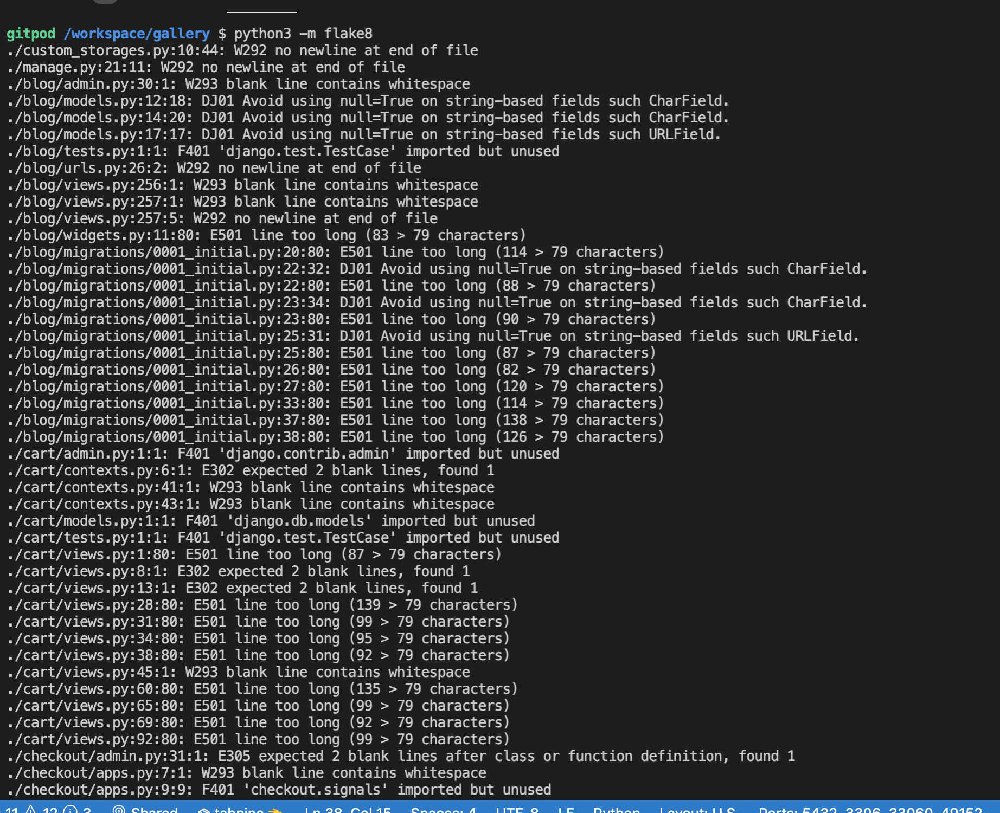
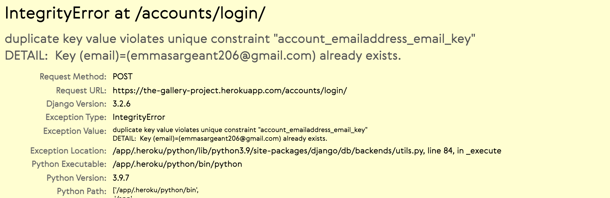
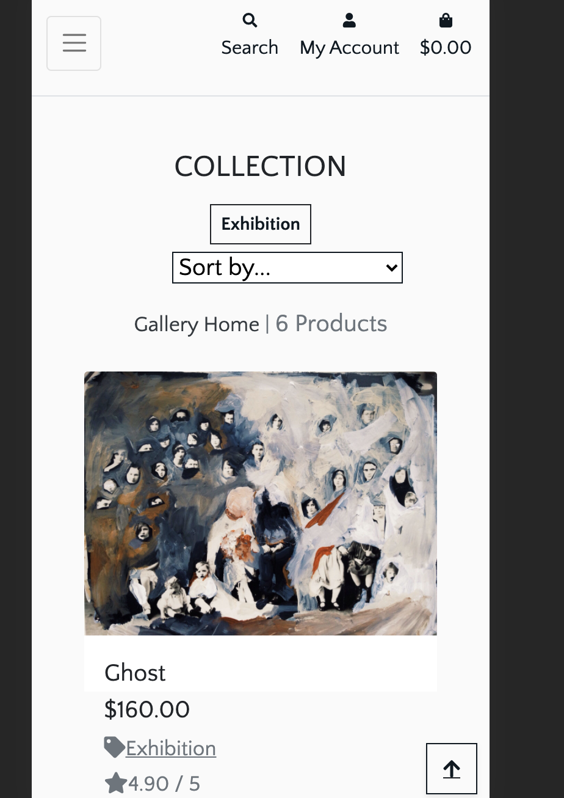
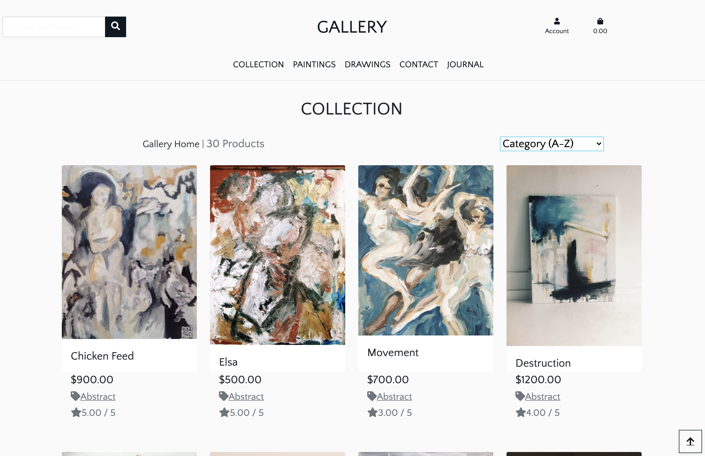
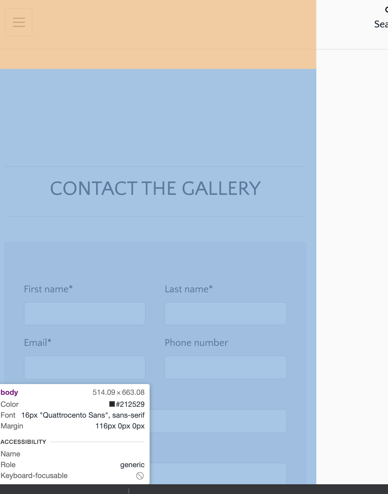

# Testing #
---

## Table of Contents ##
---

* 1. [Validation](#validation)
* 2. [Manual testing](#manual)
        * [Viewing and Navigation](#viewing)
        * [Registration and Accounts](#registration)
        * [Product sorting and searching](#searching)
        * [Purchase and Checkout](#purchase)
        * [Admin and Store Management](#admin)
        * [Stripe](#stripe)
        * [Security](#security)
        * [Acessibility](#acessibility)
        * [Blog](#blog)
* 3. [Issues](#issues)

## Validation ## 
---
This project was created on Chrome but has been tried on a Samsung galaxy, iphone, Macbook Pro, MacBook Air, Lenovo and large desktop. It works on Explorer and Safari too though I have been having issues with styling on Safari. 

**HTML**

[**W3C Markup Validator Service**](https://validator.w3.org/) for testing HTML.
 All issues are fixed

**CSS**

[**W3C CSS Validator Service**](https://jigsaw.w3.org/css-validator/) to test CSS.

 All issues are fixed

**Javascript**

[**JSHint**]() to validate Javascript files. All issues are fixed

**Python**

Gitpod built-in linter and [**PEP8**] to test Python files.

## Manual Testing ## 
---

**1. Viewing and Navigation**

As a a visitor I want this site to intuitive

* Expected: Site is clean with easy-to-use flow.
* Testing: Found navigation bar and homepage cta to see products and create purchase
* Result: site had everything visible and accessible. Safari not displaying same as Chrome.

**2. Registration**

I want to easily find where to register and for the process to be fast

* Expected: Admin icon or cta
* Testing: Found icon and registered easily with form
* Result: Registration was quick and an email was sent to my account to validate the username_email

**3. Product Search**

User can search site for any product with filter and search bar

* Expected: Search bar in a visible location
* Testing: Looked up benign words like nude and is and the search bar worked
* Result: Search bar works and detects categories and text in details

**4. Purchase and Checkout**

User can securely purchase their item or save item to cart

* Expected: Intuitive funnel to checkout
* Testing: Logged in and out of account to see if my products would still be in cart, they were. Added multiple products, deleted products from cart.
* Result: Functionality is successful

**5. Admin and Store management**

Admin and super user can log into the site or visit the admin page to use CRUD on projects
* Expected: admin can have access to more secure functions
* Testing: Logged in as admin, had more access than regular user, added products and edited products. 
* Result: Admin and super user can adjust products and blogs in admin settings.
* 

**6. Stripe** 
Secure payment

* Expected: user can log in credit card details to secure a payment 
* Testing: User completes checkout funnel and adds payment with false card 42424242424242 424 4242. Payment is successful and email is sent. Checked webhooks in stripe and they are successful. Checked webhook success on

* Result: functioning and secure payment method

**7. Security** 
* Expected: Admin and superusers have privelged and secure access to security
* Testing: Log out of admin account and force page in url. Luckily when logged out, I could not access admin priveleges
* Result: Secure site for business owners and admin.

**8. Accessibility** 
* Expected: site performs well on various devices but with a mobile-first focus
* Testing: used an ipad 6, iphone 10, iphone7, macbook pro, lenovo think pad.
* Result: the site was looking fine but some input forms aren't translating to desktop. 

* 
* 
* 

**9. Blog** 
* Expected: A blog that admins can add, edit and delete. Users can only see the blog but can write comments. The admin can delete or edit comments. 
* Testing: As admin I created and added a blog, added a comment and deleted them. When logged in as a guest, I could read the blog and write a comment. I could not edit or delete the blog or comments.
* Result: Blog and comments are working

## Issues ##

* Safari isn't reading the CSS well despite running the css files through [this](https://autoprefixer.github.io/ ) but the changes didn't make a different for Safari. Chrome and IE are just fine.

* The input forms were sized wrong, and despite trying to justify center, I was unable to move the forms center to the page. Due to lack of time due to work commitments, I haven't solved this successfully. I have played with margins and container-fluid. There is no margin or padding that can be detected as see below:

* At one point I lost all my database showing on my site after I updated my json files. I ran this: 
heroku run - 

* python manage.py shell
* from products.models import Product
* Product.objects.all().delete()
* exit()
* heroku run python manage.py loaddata products

* Trying to reach my django admin off my heroku site but I was not able to reach it, I get server error 500, in settings I needed to check the ALLOWED_HOSTS = [] was correct

* I was getting 404 error message from my webhooks. This was resolved by checking my URL
